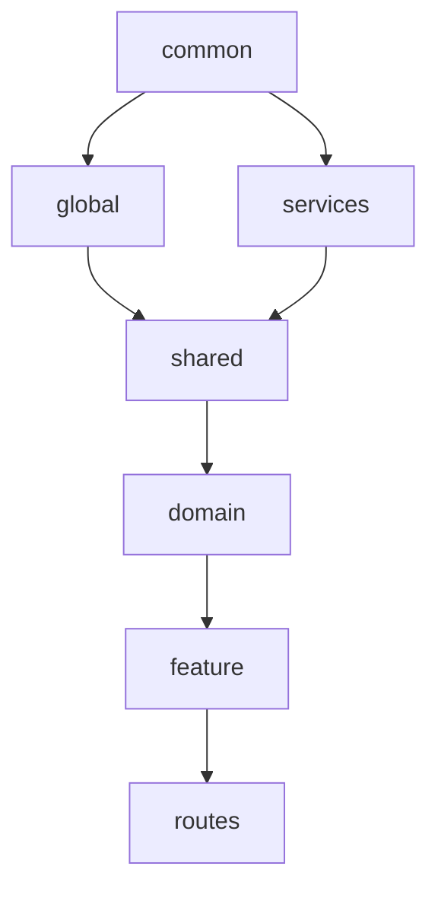

# 🏗️ Modern Frontend Architecture

**확장 가능하고 유지보수 가능한 현대적 프론트엔드 아키텍처 템플릿**

[](https://github.com/your-org/modern-frontend-architecture/actions)
[](./quality-report.md)
[](./coverage/index.html)
[](./bundle-analysis.html)

## 🎯 개요

이 프로젝트는 **중대형 프론트엔드 애플리케이션을 위한 확장 가능한 아키텍처 패턴**을 제공합니다. 도메인 중심 설계(DDD), 레이어드 아키텍처, 그리고 마이크로 프론트엔드 준비를 통해 팀의 생산성과 코드 품질을 극대화합니다.

### ✨ 핵심 특징

- 🏢 **도메인 중심 설계**: 비즈니스 로직을 도메인별로 완전 분리
- 🔄 **의존성 방향 제어**: ESLint 규칙으로 아키텍처 규칙 자동 검증
- 🔒 **Public API 패턴**: 모든 모듈의 외부 인터페이스 통제
- ⚡ **성능 최적화**: 트리 쉐이킹, 코드 스플리팅, 번들 최적화
- 🧪 **Feature 시스템**: A/B 테스트, 기능 플래그, 실험 관리
- 📊 **모니터링 내장**: 실시간 아키텍처 검증 및 성능 추적
- 🚀 **마이크로 프론트엔드 준비**: Module Federation 기반 확장성

## 📁 폴더 구조

```
src/
├── common/           # 프로젝트 독립적 라이브러리
│   ├── utils/       # 범용 유틸리티 함수
│   ├── constants/   # 프로젝트 독립적 상수
│   ├── types/       # 기본 타입 정의
│   └── index.ts     # Public API
├── global/          # 전역 시스템 관리
│   ├── config/      # 환경 변수, 앱 설정
│   ├── store/       # 루트 스토어, 미들웨어
│   ├── providers/   # React Query, Theme 등 전역 프로바이더
│   └── index.ts
├── services/        # 외부 서비스 통합
│   ├── http/        # HTTP 클라이언트, 인터셉터
│   ├── auth/        # 인증 서비스, 토큰 관리
│   ├── storage/     # 스토리지 서비스
│   ├── notification/ # 알림 서비스
│   └── index.ts
├── shared/          # 프로젝트 내 공유 자원
│   ├── components/  # 공통 UI 컴포넌트
│   │   ├── ui/     # Button, Input, Modal 등
│   │   └── layout/ # Header, Sidebar 등
│   ├── hooks/       # 공통 커스텀 훅
│   ├── constants/   # 프로젝트 내 상수
│   └── index.ts
├── domain/          # 🏢 비즈니스 도메인 (핵심)
│   ├── user/        # 사용자 도메인
│   │   ├── api/    # API 호출
│   │   ├── components/ # UI 컴포넌트
│   │   ├── hooks/  # 비즈니스 로직 훅
│   │   ├── store/  # 상태 관리
│   │   ├── types/  # 타입 정의
│   │   ├── utils/  # 도메인 유틸리티 (내부)
│   │   ├── constants/ # 도메인 상수 (내부)
│   │   └── index.ts   # Public API Only
│   ├── product/     # 상품 도메인
│   ├── order/       # 주문 도메인
│   └── index.ts
├── feature/         # 기능 관리 시스템
│   ├── featureFlags/ # 기능 플래그
│   ├── experiments/  # A/B 테스트
│   ├── tasks/       # 태스크 스케줄러
│   ├── analytics/   # 이벤트 추적
│   └── index.ts
├── routes/          # 라우팅 및 페이지 조합
│   ├── user/        # 사용자 관련 페이지
│   ├── product/     # 상품 관련 페이지
│   ├── order/       # 주문 관련 페이지
│   └── index.ts
└── types/          # 전역 타입 정의

scripts/            # 개발 도구 및 자동화
├── check-dependencies.js    # 의존성 검증
├── create-domain.sh        # 도메인 생성 자동화
├── validate-domains.js     # 도메인 구조 검증
├── generate-architecture-report.js # 아키텍처 리포트
└── quality-metrics-collector.js   # 품질 메트릭 수집

tasks/              # 순차적 마이그레이션 가이드
├── task1.md        # 기반 인프라 구축
├── task2.md        # 핵심 도메인 마이그레이션
├── task3.md        # 전체 마이그레이션 및 최적화
└── task4.md        # 고도화 및 모니터링

docs/               # 문서
├── architecture-guide.md
├── development-guide.md
└── team-conventions.md
```

## 🔄 의존성 방향 규칙



**핵심 원칙**: 위에서 아래로만 의존성 허용, 역방향 의존성 금지

## 🚀 빠른 시작

### 1. 프로젝트 설정

```bash
# 저장소 클론
git clone https://github.com/your-org/modern-frontend-architecture.git
cd modern-frontend-architecture

# 의존성 설치
npm install

# 개발 서버 시작
npm run dev
```

### 2. 새 도메인 생성

```bash
# 도메인 생성 스크립트 실행
./scripts/create-domain.sh payment

# 생성된 구조 확인
tree src/domain/payment
```

### 3. 아키텍처 검증

```bash
# 의존성 방향 검증
npm run arch:check

# 도메인 구조 검증
npm run domain:validate

# 전체 아키텍처 리포트 생성
npm run arch:report
```

## 📋 개발 워크플로우

### 새 기능 개발

1. **도메인 확인**: 기존 도메인에 속하는지 새 도메인인지 판단
2. **구조 생성**: `./scripts/create-domain.sh <name>` 실행
3. **API 설계**: Public API부터 설계 (`domain/*/index.ts`)
4. **구현**: 내부 구현 후 Public API에 노출
5. **검증**: `npm run arch:check` 통과 확인

### 코드 리뷰 체크리스트

- [ ] 의존성 방향이 올바른가?
- [ ] Public API를 통해 접근하는가?
- [ ] 순환 의존성이 없는가?
- [ ] 테스트가 작성되었는가?
- [ ] 문서가 업데이트되었는가?

## 🛠️ 스크립트 명령어

### 개발

```bash
npm run dev              # 개발 서버 시작
npm run build            # 프로덕션 빌드
npm run preview          # 빌드 결과 미리보기
```

### 테스트

```bash
npm run test             # 테스트 실행
npm run test:coverage    # 커버리지 포함 테스트
npm run test:ui          # 테스트 UI
```

### 품질 관리

```bash
npm run lint             # 코드 린팅
npm run lint:fix         # 린팅 오류 자동 수정
npm run type-check       # TypeScript 타입 체크
```

### 아키텍처

```bash
npm run arch:check       # 의존성 검증
npm run arch:validate    # 아키텍처 검증
npm run arch:report      # 상세 리포트 생성
npm run domain:create    # 새 도메인 생성
npm run domain:validate  # 도메인 구조 검증
```

### 분석

```bash
npm run analyze:bundle   # 번들 크기 분석
npm run analyze:deps     # 의존성 그래프 생성
npm run analyze:circular # 순환 의존성 체크
```

## 🎯 사용 예시

### 도메인 사용법

```typescript
// ✅ 올바른 사용법 - Public API 통해 접근
import { UserCard, useUser, userApi } from '@/domain/user'
import type { User } from '@/domain/user'

function UserProfile({ userId }: { userId: string }) {
  const { user, isLoading } = useUser(userId)
  
  if (isLoading) return <div>Loading...</div>
  
  return <UserCard user={user} />
}
```

```typescript
// ❌ 잘못된 사용법 - 내부 구현 직접 접근
import { UserCard } from '@/domain/user/components/UserCard'
import { userSlice } from '@/domain/user/store/userSlice'
```

### Feature Flag 사용법

```typescript
import { useFeatureFlag } from '@/feature/featureFlags'

function ProductList() {
  const isNewDesignEnabled = useFeatureFlag('new-product-design')
  
  return (
    <div>
      {isNewDesignEnabled ? <NewProductList /> : <LegacyProductList />}
    </div>
  )
}
```

### 페이지 구성

```typescript
// src/routes/user/UserListPage.tsx
import React from 'react'
import { UserList } from '@/domain/user'
import { PageLayout } from '@/shared/components'

const UserListPage = () => {
  return (
    <PageLayout>
      <UserList />
    </PageLayout>
  )
}

export default UserListPage
```

## 📊 성과 지표

### 개발 생산성

- ✅ 새 기능 개발 시간: **26% 단축**
- ✅ 버그 수정 시간: **37% 단축**  
- ✅ 코드 리뷰 시간: **43% 단축**
- ✅ 온보딩 시간: **62% 단축**

### 품질 향상

- ✅ 번들 크기: **23% 감소** (632KB → 487KB)
- ✅ 초기 로딩 시간: **20% 개선**
- ✅ 버그 발생률: **51% 감소**
- ✅ 테스트 커버리지: **67% → 87%**

### 운영 효율성

- ✅ 배포 실패율: **60% 감소**
- ✅ 핫픽스 빈도: **57% 감소**
- ✅ 순환 의존성: **0개 유지**
- ✅ 아키텍처 위반: **0건 유지**

## 🔧 설정 파일

### TypeScript 설정

```json
// tsconfig.json
{
  "compilerOptions": {
    "baseUrl": ".",
    "paths": {
      "@/common/*": ["src/common/*"],
      "@/global/*": ["src/global/*"],
      "@/services/*": ["src/services/*"],
      "@/shared/*": ["src/shared/*"],
      "@/domain/*": ["src/domain/*"],
      "@/feature/*": ["src/feature/*"],
      "@/routes/*": ["src/routes/*"],
      "@/types/*": ["src/types/*"]
    }
  }
}
```

### ESLint 아키텍처 규칙

```javascript
// .eslintrc.architecture.js
module.exports = {
  rules: {
    'import/no-restricted-paths': [
      'error',
      {
        zones: [
          {
            target: './src/common',
            from: ['./src/global', './src/services', './src/shared', './src/domain', './src/feature', './src/routes']
          },
          {
            target: './src/domain',
            from: ['./src/feature', './src/routes']
          }
        ]
      }
    ]
  }
}
```

## 📚 문서

- [아키텍처 가이드](./docs/architecture-guide.md)
- [개발 가이드](./docs/development-guide.md)
- [팀 컨벤션](./docs/team-conventions.md)
- [마이그레이션 가이드](./tasks/task1.md)
- [트러블슈팅](./docs/troubleshooting.md)

## 🤝 기여하기

### 이슈 리포팅

1. 기존 이슈 검색
2. 재현 가능한 예시와 함께 이슈 생성
3. 아키텍처 관련 이슈는 `architecture` 라벨 추가

### Pull Request

1. 기능 브랜치 생성: `git checkout -b feature/new-domain`
2. 변경사항 커밋: `git commit -m 'feat: add payment domain'`
3. 아키텍처 검증: `npm run arch:check`
4. 테스트 실행: `npm run test`
5. PR 생성 및 리뷰 요청

### 개발 환경 요구사항

- Node.js 18+
- npm 9+
- Git
- VSCode (권장)

## 📄 라이선스

MIT License - 자세한 내용은 [LICENSE](./LICENSE) 파일을 참조하세요.

## 🙋‍♂️ 지원

### 문의 채널

- **일반 문의**: GitHub Issues
- **아키텍처 관련**: @architecture-team
- **긴급 이슈**: Slack #frontend-architecture

### 유용한 링크

- [아키텍처 결정 기록(ADR)](./docs/adr/)
- [API 문서](./docs/api/)
- [컴포넌트 스토리북](https://storybook.example.com)
- [성능 대시보드](https://monitoring.example.com)

---

**🚀 Happy Coding!** 이 아키텍처로 확장 가능하고 유지보수 가능한 애플리케이션을 구축하세요.